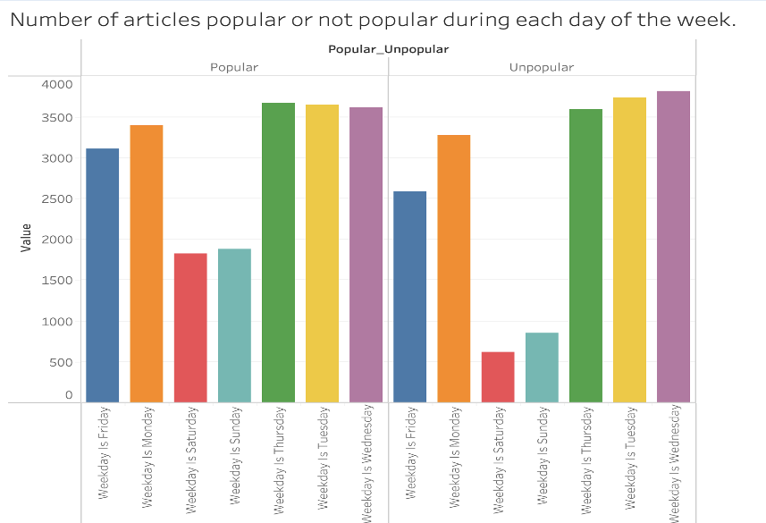
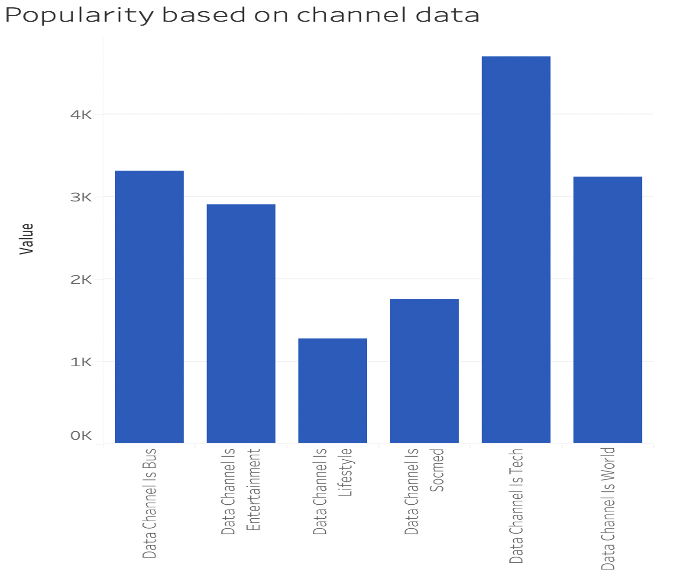
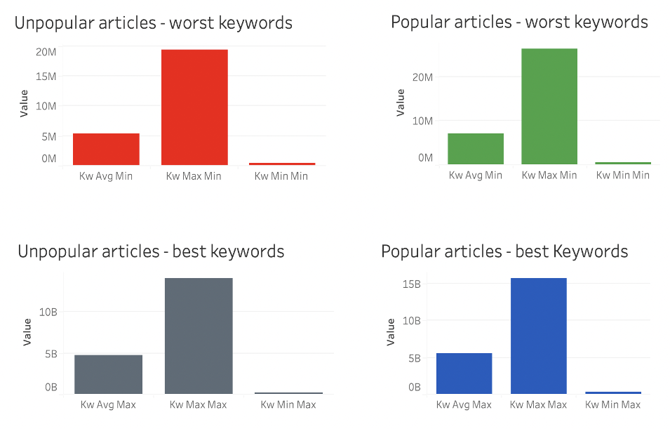
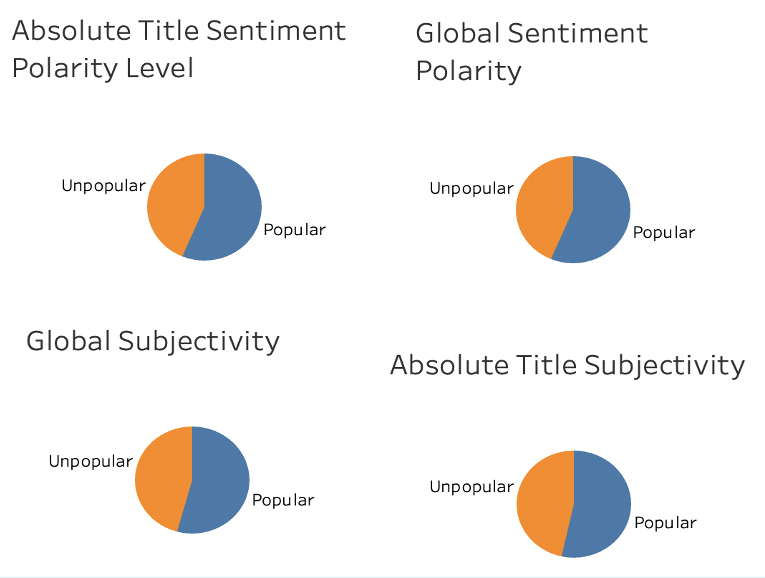
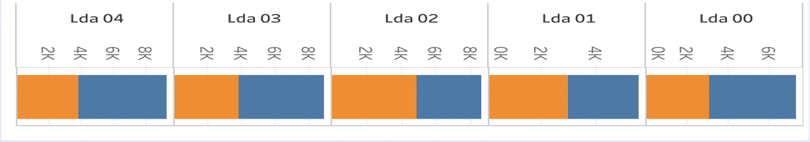
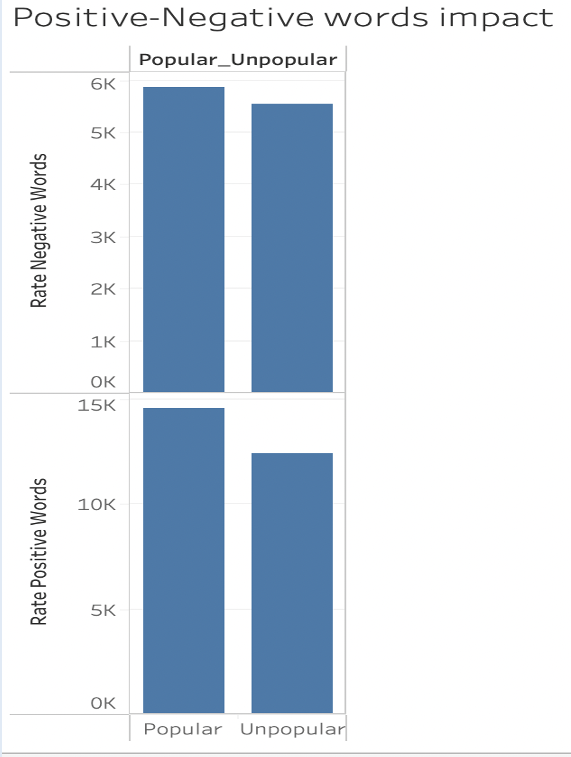
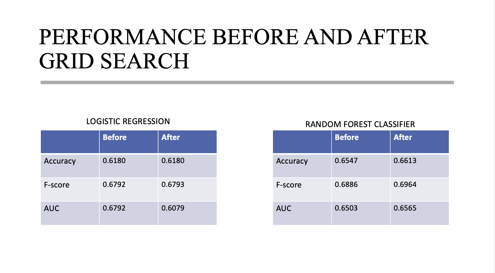

# Popularity-Prediction
Popularity Prediction of Online News Articles with Python and Tableau.

<h2>Introduction:</h2>
<ul><li>Online news may be immediately distributed around the world thanks to the Internet. </li>
<li>The number of readers, likes, and shares is usually a good indicator of how popular a piece of news is. </li>
<li>It is extremely advantageous for online news providers such as content producers and advertising if the popularity of news pieces can be reliably predicted ahead to publication.</li> 
<li>As a result, using machine learning techniques to forecast the popularity of online news pieces is both interesting and useful.</li></ul>

<h2>Problem Statement:</h2>
<ul><li>The goal of this project is to apply machine learning techniques to solve a binary classification problem, especially, predicting whether or not an online news article will become popular before it is published. </li>
<li>The article is branded as popular if the number of shares exceeds a pre-determined threshold (here 50%), else it is labeled as unpopular.</li>
<li>Three evaluation measures are utilized in a classification task which are Accuracy, F1-score, and AUC. For all three criteria, the greater the value, the better the model's performance.</li></ul>

<h2>Visualizations:</h2>

<ul><li>The articles published on weekends have a greater chance of being popular. It makes sense because people are more likely to spend more time online on weekends reading the news.</li>

<li>The proportion of popular news is significantly greater in the categories of technology ("data channel is tech") and Business("data channel is Bus"). This could indicate that Mashable readers prefer the technology and Business.</li>

<li>The popularity of articles based on keywords used is represented using bar graphs, which show that the popularity to unpopularity ratio is nearly identical regardless of the keywords used. Unless and until the keywords have a detrimental impact on the popularity, the popularity remains the same.</li>

<li>In pie charts, sentiment and subjectivity of the content and title are shown, and it is noticeable that everyone enjoys a good sentimental content. Furthermore, it is self-evident that the title is the most important factor in attracting readers to view the content. An article is popular if it creates a positive feeling or has a positive influence.</li>

<li>We can see the popularity of each LDA topic based on its proximity in this stacked bar chart. The LDA 00 is clearly more popular, while the LDA 02 is less so. This suggests that consumers like articles with material related to LDA topic 00 and dislike articles with content related to LDA topic 02.</li>

<li>The rate of negative or positive words has almost no effect on the target variable, as shown in this bar graph. The articles are popular regardless of the words used.</li>
 </ul>

<h2>Description:</h2>
<ul><li>Based on the above visualizations we can eliminate few of the features that will not be required to define the target variable.</li>
<li>Instead RFECV function in sklearn is used to find the appropriate features for each model (Logistic Regression and Random Forest) that might yield the best results.</li>
<li>RFECV is a Recursive feature elimination with cross-validation to select the number of features to define the target variable.</li>
<li>The data is split into equal halves for test and train (50%-50%)</li></ul>

<h2>Results:</h2>

<h2>Conclusion:</h2>
<ul><li>Sklearn is used to implement the classification algorithms Logistic Regression and Random Forest.</li>
<li>The model's hyperparameters are then fine-tuned using the grid search method.</li>
<li>Three metrics are used to evaluate and compare the refined models : Accuracy, F1-score, AUC. </li>
<li>The Random Forest model with refined hyperparameters should be used in a general setting to solve these types of problems because it achieves a fairly good performance.</li></ul>

<h2>References:</h2>
[1] https://archive.ics.uci.edu/ml/datasets/Online+News+Popularity  
[2] https://scikit-learn.org/stable/modules/generated/sklearn.feature_selection.RFECV.html  
[3] https://scikit-learn.org/stable/modules/generated/sklearn.model_selection.GridSearchCV.html  
[4] K. Fernandes, P. Vinagre and P. Cortez. A Proactive Intelligent Decision Support System for Predicting the Popularity of Online News. Proceedings of the 17th EPIA 2015 - Portuguese Conference on Artificial Intelligence, September, Coimbra, Portugal.

